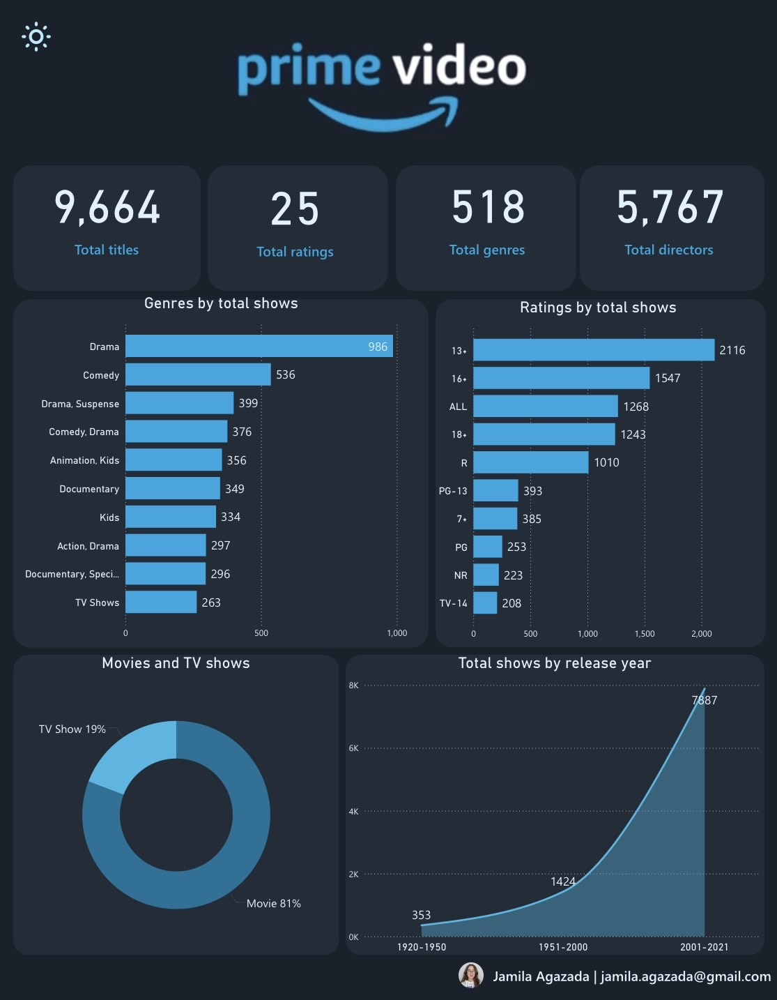
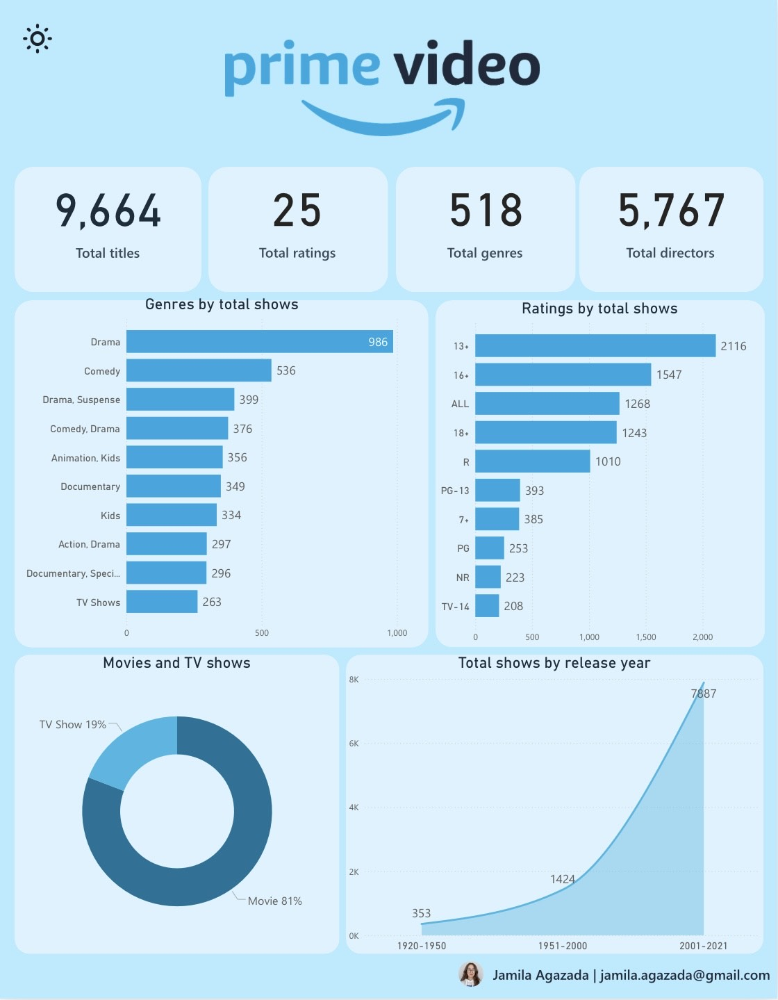

# Amazon-Prime-Video-Power-BI-Dashboard

## 🧾 Overview
This project is a Power BI Prime Video Analytics Dashboard created as part of my data analytics portfolio.
The objective of this project is to transform raw streaming platform data into clear, structured, and business-driven insights through data modeling, DAX calculations, and visual storytelling.

The dashboard provides an executive-level overview of Prime Video’s content distribution, genres, ratings, directors, and release trends.

## 🖼 Dashboard Preview

## 🔍 Key Insights
The dashboard presents the following analyses:

- 📺 **Total Content Overview**
High-level KPIs showing total titles, genres, ratings, and directors.

- 🎬 **Genre Distribution**
Identification of dominant genres, with Drama and Comedy leading the platform.

- 🔞 **Ratings Analysis**
Breakdown of content by age ratings, highlighting the most common audience categories.

- 🎥 **Movies vs TV Shows Comparison**
Clear percentage comparison of content types (Movies vs TV Shows).

- 📅 **Content Growth by Release Period**
Release years grouped into defined time intervals to visualize long-term growth trends.

## 🔗 Live Dashboard
Explore the interactive dashboard here:  
👉 **Link:**  
https://app.powerbi.com/view?r=eyJrIjoiYTI5YmZjYWEtN2FlYS00MzQyLWFjZjQtY2IwZTU3NjJkMjlhIiwidCI6ImUwNTNjOTY0LTM3YmMtNDhkYi1hZmQ1LWQ4YjQzODkwZTk4NSIsImMiOjl9&pageName=0f349bc5d011c453998e

## 👤 Author
**Jamila Agazada**
